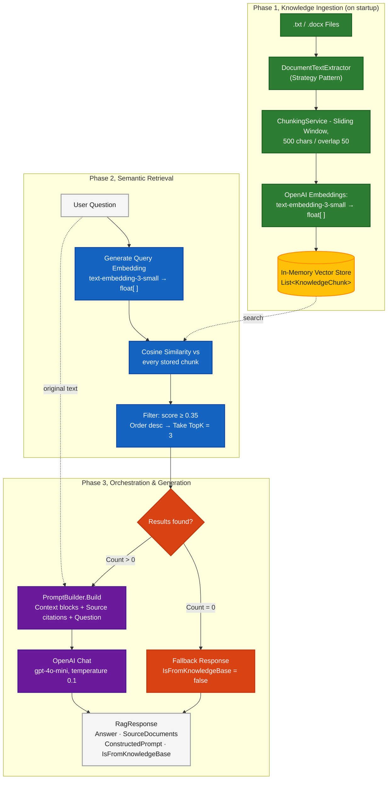
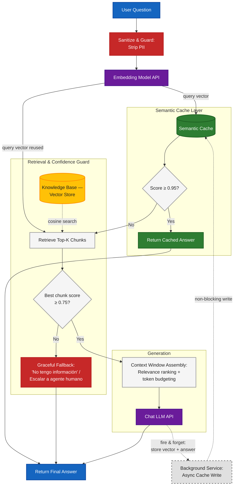

# RAG Prototype — Asistente de Bienestar Financiero

Prototipo de **Retrieval-Augmented Generation (RAG)** construido en **.NET 10 / C# 14**. Un asistente de IA que responde preguntas de bienestar financiero basándose exclusivamente en una base de conocimiento curada.

---

## Cómo ejecutar

### Prerrequisitos

- .NET 10 SDK ([descargar](https://dotnet.microsoft.com/download))
- Una API Key de OpenAI con acceso a `text-embedding-3-small` y `gpt-4o-mini`

### Configurar credenciales (User Secrets)

```bash
cd RagPrototype.API
dotnet user-secrets set "OpenAI:ApiKey" "sk-..."
```

### Ejecutar

```bash
dotnet run --project RagPrototype.API
```

La aplicación ingesta los documentos automáticamente al arrancar. Una vez iniciada, la UI interactiva de la API estará disponible en `http://localhost:5289` (Scalar).

### Hacer una pregunta

```bash
curl -X POST http://localhost:5289/api/chat \
  -H "Content-Type: application/json" \
  -d '{"question": "¿Cómo puedo construir un fondo de emergencia?"}'
```

### Ejecutar tests

```bash
dotnet test
```

52 tests unitarios. Sin dependencias externas, se ejecutan sin API key ni Docker.

---

## El flujo RAG — qué hace el código paso a paso



El campo `ConstructedPrompt` siempre se devuelve en la respuesta para poder inspeccionar el prompt construido.

**Ejemplo de prompt construido para la pregunta `"¿Cómo puedo construir un fondo de emergencia?"`:**

```
Eres un asistente de bienestar financiero. Responde ÚNICAMENTE basándote en el contexto proporcionado.
Si el contexto no contiene suficiente información, indícalo claramente.

=== CONTEXTO ===
[Fuente: doc1_finanzas.txt]
Un fondo de emergencia es una reserva líquida equivalente a entre 3 y 6 meses de gastos básicos mensuales.
Debe mantenerse en una cuenta de fácil acceso, separada de los ahorros de largo plazo, para cubrir
imprevistos sin necesidad de endeudarse...

[Fuente: doc3_bienestar.txt]
La regla 50/30/20 sugiere destinar el 20% de los ingresos al ahorro y metas financieras.
Para construir el fondo, se recomienda comenzar con una meta pequeña ($500), automatizar
una transferencia mensual fija y ajustarla al alza conforme crezcan los ingresos...

=== PREGUNTA ===
¿Cómo puedo construir un fondo de emergencia?

=== INSTRUCCIONES ===
- Responde en español, de forma clara y concisa.
- Cita el documento fuente cuando sea relevante.
- Si no puedes responder con el contexto dado, di: "No tengo información sobre eso en mi base de conocimiento."
```

---

## Decisiones técnicas

### Arquitectura: Clean Architecture + Vertical Slices

Elegí **Clean Architecture** para hacer cumplir una regla de dependencias estricta: el dominio no sabe nada de OpenAI, EF Core ni de ningún framework. Si mañana cambio el proveedor de embeddings de OpenAI a Cohere, solo toco `RagPrototype.Infrastructure` — `RagPrototype.Application` no se mueve.

Dentro de la capa de Application usé **Vertical Slice Architecture**: el código de cada feature vive junto (`Features/Chat/`, `Features/Ingestion/`). Para un prototipo de este tamaño evita la dispersión de archivos que produciría un layout técnico clásico (`Services/`, `DTOs/`, `Validators/`).

### SDK nativo de OpenAI en lugar de Semantic Kernel o Kernel Memory

Elegí el SDK nativo para mantener el control absoluto sobre el ciclo de vida del RAG (generación del prompt, inyección de contexto y orquestación de llamadas). Frameworks como Semantic Kernel o LangChain son excelentes para orquestación compleja con múltiples agentes, pero en un prototipo introducen abstracciones pesadas ('magia negra') que ocultan el flujo real de datos. Mi objetivo era demostrar un entendimiento profundo de la arquitectura base y la manipulación vectorial, construyendo el motor desde cero en lugar de solo cablear una librería de terceros

### Vector store en memoria con similitud coseno a mano

La decisión de usar un store en memoria prioriza la Fricción Cero (Developer Experience). El proyecto se puede auditar con un simple git clone y dotnet run, sin necesidad de levantar contenedores Docker (ej. Qdrant) o configurar cadenas de conexión. Al mismo tiempo, la abstracción de IVectorStore demuestra que el sistema está diseñado para integrarse con persistencia real (como Cosmos DB) sin tocar la lógica de negocio.

### Chunks de 500 caracteres con overlap de 50

Basado en la naturaleza de los documentos (guías operativas y reglas de negocio), 500 caracteres (aprox. 100-120 tokens) es el punto dulce para capturar un concepto lógico completo sin diluir el vector con ruido periférico. El overlap de 50 caracteres funciona bajo el patrón de Sliding Window, asegurando que si una instrucción importante cruza el límite de un chunk, el contexto no se mutile y el modelo de embeddings pueda capturar la semántica completa de la transición

### Similitud coseno y no L2 o dot product

Los embeddings de `text-embedding-3-small` son vectores normalizados. Para vectores de magnitud unitaria, la similitud coseno y el dot product son equivalentes, pero coseno es más legible semánticamente (rango −1 a 1, donde 1 = idénticos). L2 mide distancia, no similitud, lo que invierte la lógica de comparación.

### Result\<T\> en lugar de excepciones para control de flujo

Las excepciones son para fallos de infraestructura inesperados (la red cae, el disco falla). Una pregunta sin respuesta en la KB, un embedding que falla por rate limit, o un chunk vacío son **estados esperados** del negocio, tratarlos como valores obliga al compilador a que cada llamador los maneje explícitamente.

### Temperatura 0.1 en el LLM

El asistente debe ser factual y basarse en el contexto recuperado. Una temperatura baja reduce la creatividad del modelo y lo ancla al contexto del prompt, que es exactamente el comportamiento correcto para un sistema RAG.

### Strategy Pattern para extracción de documentos

Implementar la lectura de `.txt` y `.docx` como estrategias intercambiables respeta el principio Open/Closed: agregar soporte para `.pdf` o `.md` requiere solo una nueva clase que implemente `IDocumentExtractionStrategy` y registrarla en DI. `IngestionService` no se modifica.

---

## Nota de producción

### Secretos y configuración

- Mover `OpenAI__ApiKey` a **Azure Key Vault** o equivalente. Nunca a variables de entorno planas en producción.
- `KnowledgeBase__SimilarityThreshold` y `TopK` como configuración por entorno, producción probablemente necesita valores distintos que desarrollo.

### Persistencia del vector store

El `InMemoryVectorStore` actual pierde todos los datos al reiniciar el proceso. En producción se reemplazaría por **Qdrant**, **Azure Cosmos DB con DiskANN** o **pgvector**. El contrato `IVectorStore` en `RagPrototype.Application` no cambia, solo se agrega una implementación nueva en `RagPrototype.Infrastructure`.

### Ingesta

En producción, con un vector store persistente (Qdrant, pgvector), la ingesta no necesita correr en cada startup. Sería un proceso separado, un **Background Service** o un endpoint admin autenticado con `[Authorize(Roles = "admin")]`,
que se dispara únicamente cuando hay documentos nuevos o actualizados en la KB.

### Observabilidad

Serilog ya está configurado con structured logging. Los siguientes pasos serían:
- Agregar **OpenTelemetry traces** en `OpenAiEmbeddingService` y `OpenAiLlmService` para medir latencias de las llamadas externas.
- Registrar el `SimilarityScore` de los chunks recuperados como métrica para detectar degradación de la KB (si los scores promedio caen, la KB se está quedando desactualizada).
- El `Stopwatch` que mide el tiempo de respuesta del LLM ya existe, llevar eso a un histograma en Prometheus/Azure Monitor.

### Manejo de errores

El `GlobalExceptionHandler` captura cualquier excepción no manejada y retorna Problem Details (RFC 7807) sin exponer stack traces. El patrón `Result<T>` garantiza que los errores de negocio siempre llegan al cliente con `error_code` estructurado. El siguiente paso sería agregar un `ValidationExceptionHandler` separado para `FluentValidation.ValidationException` si se decide agregar validación de entradas más compleja.

### Escalabilidad

Dado que el vector store está en memoria y es un Singleton, la solución actual no escala horizontalmente (múltiples instancias tendrían stores distintos). La migración a un vector store externo resuelve esto sin tocar ninguna capa excepto Infrastructure.

### Inyección de dependencias

El proyecto expone exactamente dos métodos de extensión: `AddApplication()` en `RagPrototype.Application` y `AddInfrastructure()` en `RagPrototype.Infrastructure`. `Program.cs` solo los invoca, ningún servicio se registra directamente en el punto de entrada.

Esto significa que en producción, migrar el vector store es un cambio de una sola línea en `AddInfrastructure()`:

```csharp
// Prototipo
services.AddSingleton<IVectorStore, InMemoryVectorStore>();

// Producción, única línea que cambia en Infrastructure
services.AddSingleton<IVectorStore, QdrantVectorStore>();
```

`ChatService` e `IngestionService` no se modifican. El mismo principio aplica a `IEmbeddingService` e `ILlmService`: cambiar de OpenAI a Azure OpenAI significa registrar una nueva implementación en `RagPrototype.Infrastructure` sin tocar `RagPrototype.Application`.

### Arquitectura de producción completa

Cuatro adiciones clave respecto al prototipo:

- **Sanitización de entrada** — strip de PII antes de que la pregunta toque cualquier API externa.
- **Semantic cache** — si una pregunta similar (score ≥ 0.95) ya fue respondida, se retorna la respuesta cacheada sin llamar al LLM ni al vector store. El write al cache es fire-and-forget y no bloquea la respuesta al usuario.
- **Confidence guard** — el prototipo usa un umbral de 0.35 para filtrar chunks individuales. En producción se agrega un segundo umbral (0.75) sobre el score del mejor chunk: si ninguno supera esa barra, el sistema hace fallback elegante en lugar de pasarle contexto de baja calidad al modelo.
- **Context window budgeting** — antes de llamar al LLM, los chunks se rankean por relevancia y se recortan al presupuesto de tokens disponible para no exceder el context window.



---

